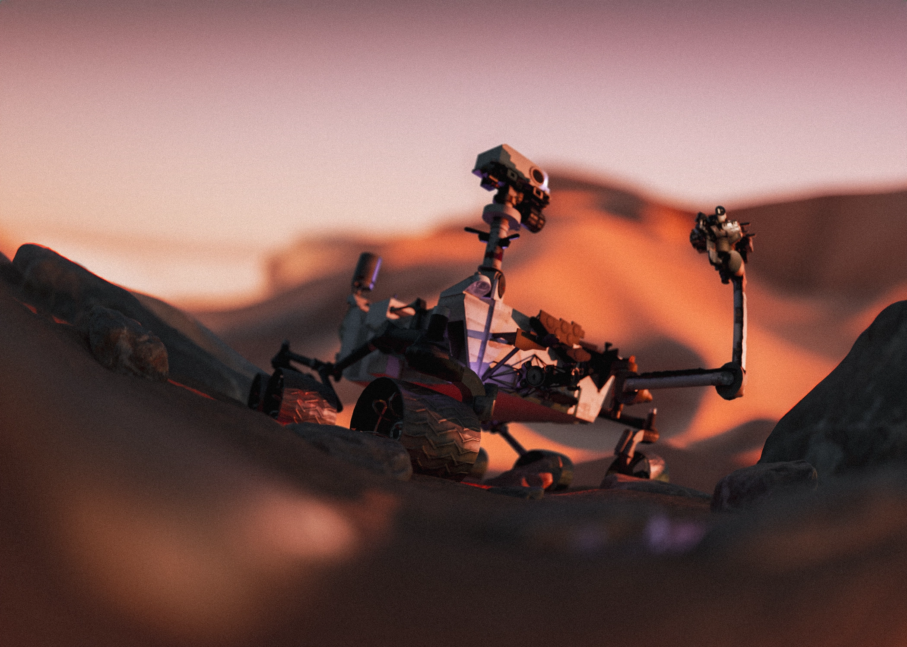

# 🚀 Nasa's Curiosity Rover Images 🤖 🟠



Explore, _out-of-this-world_ (pun intended), photos taken by NASA's Curiosity Rover on Mars!

[Example site](https://nasa-tawny-gamma.vercel.app/)

The Curiosity Rover is equipped with **nine cameras**, each capturing unique perspectives of our neighboring planet.  
This project utilizes the [NASA APIs](https://api.nasa.gov/), specifically the **"Mars Rover Photos"** endpoint.

---

## How to Use

1. **Clone this repository**

2. **Install Dependencies**

```sh
npm install
```

3. **Generate an API Key by visiting, [NASA APIs](https://api.nasa.gov/)**

4. **Create a .env file in the project's root directory with the following format (since we're building with VITE)**

```sh
VITE_NASA_API_KEY=[your_generated_key]
```

5. **Start the development server**

```sh
npm run dev
```

6. Enjoy! 🤖🌍🚀

## Notes

- The **Curiosity 3D Model** was downloaded from NASA:
  [Curiosity Rover 3D Model](https://science.nasa.gov/resource/curiosity-rover-3d-model/)
- For the hero landing image, I placed the 3D model in Blender and did my _best_ to create a Martian Scene.
- There are multiple days that there will be no data for photos. Fear not, try other days and browse by "All".
- One day, if time permits, other rovers will be added.

## License

This project is open-source. Feel free to explore, modify, and contribute!
